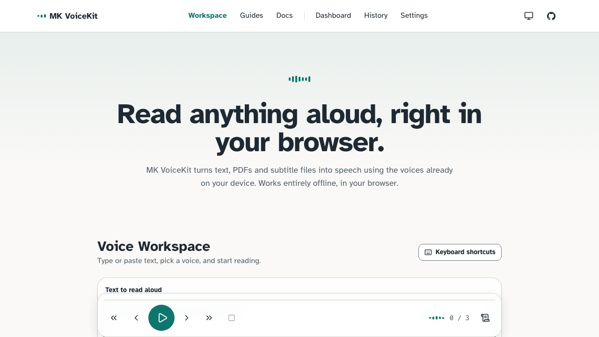

# MK VoiceKit

Read anything aloud in your browser — a free, local-first text-to-speech workspace with no account, no upload, and no server-side storage.


**Live**

- Production: [voicekit.mkazi.live](https://voicekit.mkazi.live) — _DNS pending; the domain is being pointed at Vercel._
- Current deploy: [mk-voicekit.vercel.app](https://mk-voicekit.vercel.app)

## What it does

Read any text, PDF, or subtitle file aloud in the browser using your device's own
on-device voices. The current sentence highlights as it plays, you can jump
around by chapter or keyboard, and everything you paste or import stays on your
machine. An optional AI layer can prep text for smoother narration, but the whole
workspace works fully without it.

## Features

The core is deterministic and runs entirely in your browser. The AI features are
optional and clearly separated.

**Core (no AI, no network)**

- Reads plain text, Markdown, PDFs (text extracted client-side), and subtitle
  files (`.srt` / `.vtt`, with timestamps stripped).
- Highlights the current sentence as it plays — and the current word where the
  browser reports word timing — so you never lose your place.
- Full keyboard control: play/pause, move by sentence or paragraph, stop, and
  adjust speed, with a shortcuts dialog where every listed shortcut works.
- Voice picker grouped by language that remembers your last voice per language,
  and shows an explanatory state (never a blank list) when the browser exposes
  no voices.
- Speed, pitch, and volume controls with live readouts, plus saveable named
  presets.
- Local listening queue and history with "Speak again", all stored in IndexedDB,
  with export / import / clear-all in Settings.
- Deterministic in-browser text-prep: number and abbreviation expansion and
  punctuation smoothing, clearly labelled as local processing (not AI).

**Optional AI (Vercel AI Gateway)**

- Ten text tools: rewrite for natural speech, simplify, change reading level,
  translate, summarize, generate chapters, article-to-podcast script,
  notes-to-narration, multi-speaker formatting, and pronunciation suggestions.
- When no gateway credential is present, AI routes return a clean
  `ai_unavailable` response and the UI shows an honest degraded state — nothing
  else in the app is affected. A bring-your-own-key option is supported.

**An honest limitation: no audio download.** The browser speech engine
(`speechSynthesis`) plays audio but never hands back a file, so there is nothing
to save. Rather than fake an export button, the app says so plainly.

## Screenshots



## Tech stack

- **Next.js** (App Router, `src/` directory).
- **TypeScript** in strict mode.
- **Tailwind CSS v4** with `lucide-react` icons.
- **IndexedDB** (via `idb`) for all local-first storage — history, presets, queue.
- **Vercel AI Gateway** (via the `ai` SDK) for the optional AI layer only.
- **Zod** for API input validation.
- **Vitest** (+ Testing Library, `fake-indexeddb`) and **Playwright** for tests.

No database. No accounts. No signup. Nothing to log into.

## Project structure

Every top-level `src/` folder and the files that matter, with one line each.

```
src/
├── app/                          # Next.js App Router — routes, API, SEO endpoints
│   ├── layout.tsx                # Root layout: fonts, theme, header/footer, metadata
│   ├── page.tsx                  # Landing page
│   ├── tool/page.tsx             # The main text-to-speech workspace
│   ├── globals.css               # Tailwind v4 base styles and design tokens
│   ├── error.tsx                 # Route-level error boundary UI
│   ├── loading.tsx               # Route-level loading UI
│   ├── not-found.tsx             # 404 page
│   ├── opengraph-image.tsx       # Generated Open Graph image
│   ├── robots.ts                 # robots.txt route handler
│   ├── sitemap.ts                # Registry-driven sitemap
│   ├── api/ai/[capability]/route.ts  # Server route for the optional AI capabilities
│   ├── dashboard/page.tsx        # Usage dashboard route
│   ├── history/page.tsx          # Listening history route
│   ├── settings/page.tsx         # Settings (export / import / clear-all) route
│   ├── docs/page.tsx             # In-app documentation
│   ├── changelog/page.tsx        # User-facing changelog
│   ├── faq/page.tsx              # FAQ (also emits FAQPage JSON-LD)
│   ├── guides/…                  # Ten how-to guides (one folder each)
│   ├── use-cases/…               # Five use-case pages
│   └── about, contact, creator, open-source, privacy, terms, cookies  # Info + legal pages
├── components/
│   ├── workspace/                # The reading workspace UI
│   │   ├── Workspace.tsx         # Top-level workspace composition
│   │   ├── PlaybackBar.tsx       # Play/pause, navigation, speed controls
│   │   ├── Transcript.tsx        # Segmented text with live sentence/word highlight
│   │   ├── VoicePicker.tsx       # Voices grouped by language
│   │   ├── QueuePanel.tsx        # Listening queue
│   │   ├── PresetBar.tsx         # Named speed/pitch/volume presets
│   │   ├── ImportDropzone.tsx    # Text / Markdown / PDF / subtitle import
│   │   ├── AiPanel.tsx           # Optional AI tools panel
│   │   ├── TextPrepPanel.tsx     # Deterministic in-browser text-prep controls
│   │   ├── ShortcutsDialog.tsx   # Keyboard shortcut reference
│   │   └── Slider.tsx            # Accessible slider primitive
│   ├── content/                  # Building blocks for content/legal pages
│   │   ├── ArticleShell.tsx      # Guide/article page shell
│   │   ├── StaticPage.tsx        # Generic static-page layout
│   │   ├── ContentGrid.tsx       # Card grids for index pages
│   │   ├── Breadcrumbs.tsx       # Breadcrumb nav (+ BreadcrumbList JSON-LD)
│   │   ├── JsonLd.tsx            # Structured-data injector
│   │   ├── GuideTracker.tsx      # Reading-progress tracking for guides
│   │   ├── AdSlot.tsx            # Ad placeholder (disabled by default)
│   │   └── ConsentControl.tsx    # Analytics consent UI
│   ├── layout/                   # SiteHeader.tsx, SiteFooter.tsx
│   ├── theme/                    # ThemeProvider, ThemeScript, ThemeToggle (dark/light)
│   ├── pages/                    # DashboardView, HistoryView, SettingsView (client views)
│   ├── analytics/Analytics.tsx   # Consent-gated Google Tag Manager loader
│   └── ui/                       # Button.tsx, Waveform.tsx primitives
├── hooks/
│   ├── useSpeechEngine.ts        # React binding to the speech engine state machine
│   ├── useVoices.ts              # Loads and groups speechSynthesis voices
│   ├── usePrefs.ts               # Persisted user preferences
│   └── useGlobalShortcuts.ts     # Global keyboard shortcut handling
└── lib/                          # Framework-free logic (all unit-tested)
    ├── speech/                   # engine.ts state machine, chunk.ts, segment.ts, voices.ts
    ├── parsers/                  # file.ts, pdf.ts, subtitles.ts, markdown.ts (input extraction)
    ├── textprep/                 # Deterministic prep: abbreviations, numbers, pauses, index
    ├── ai/                       # Optional AI layer: catalog, client, request, models,
    │                             #   quota, rate-limit, errors, capabilities
    ├── storage.ts                # Typed IndexedDB wrapper (history, presets, queue)
    ├── content.ts                # Content/guide/use-case registry
    ├── seo.ts                    # Per-page metadata and canonical helpers
    ├── site.ts                   # Site config and navigation
    ├── analytics.ts              # Analytics event helpers
    ├── keyboard.ts, shortcuts.ts # Keyboard mapping and shortcut definitions
    ├── handoff.ts                # Passing text between routes
    └── cn.ts, format.ts, slider.ts, theme.ts  # Small shared utilities
```

## Documentation

Deeper design and operational docs live in [`docs/`](docs/):

- [`docs/ARCHITECTURE.md`](docs/ARCHITECTURE.md) — system overview and module boundaries.
- [`docs/AI_ARCHITECTURE.md`](docs/AI_ARCHITECTURE.md) — the optional AI layer and its honest degraded states.
- [`docs/DATABASE.md`](docs/DATABASE.md) — IndexedDB schema and local storage model.
- [`docs/DEPLOYMENT.md`](docs/DEPLOYMENT.md) — deploy steps and the production checklist.
- [`docs/PRIVACY.md`](docs/PRIVACY.md) — what stays on-device and what does not.
- [`docs/SECURITY.md`](docs/SECURITY.md) — threat model and disclosure policy.
- [`docs/DESIGN_SYSTEM.md`](docs/DESIGN_SYSTEM.md) — tokens, typography, and components.
- [`docs/PRODUCT_SPEC.md`](docs/PRODUCT_SPEC.md) — product scope and behaviour.
- [`docs/TEST_REPORT.md`](docs/TEST_REPORT.md) — real test-gate output and coverage.
- [`docs/AUDIT.md`](docs/AUDIT.md) — build/quality audit notes.
- Plans: [`docs/ANALYTICS_PLAN.md`](docs/ANALYTICS_PLAN.md), [`docs/MONETIZATION_PLAN.md`](docs/MONETIZATION_PLAN.md), [`docs/SEO_PLAN.md`](docs/SEO_PLAN.md).

## Getting started

**Prerequisites:** Node 20+ and [pnpm](https://pnpm.io/).

```bash
pnpm install      # install dependencies
pnpm dev          # start the dev server at http://localhost:3000
pnpm build        # production build
pnpm test         # run the unit + integration tests (vitest)
```

Other useful scripts:

```bash
pnpm typecheck      # tsc --noEmit
pnpm lint           # eslint
pnpm test:coverage  # vitest with v8 coverage
pnpm test:e2e       # playwright smoke (builds + serves)
pnpm start          # serve the production build
```

The workspace is fully usable with no environment variables set — everything
except the optional AI tools runs offline after first load.

## Environment variables

Every variable is optional. **With none set, the app builds and the whole
text-to-speech workspace works** — the AI tools simply show a graceful "AI
unavailable" state. Copy [`.env.example`](.env.example) to `.env.local` for local
development.

| Variable | Purpose | Required |
|---|---|---|
| `AI_GATEWAY_API_KEY` | Vercel AI Gateway credential that powers the optional AI tools. On Vercel it is provided automatically via OIDC on deploy. Absent ⇒ AI tools show an honest degraded state. | No |
| `AI_MODEL` | Fast-tier gateway model string (default `anthropic/claude-haiku-4.5`). | No |
| `AI_MODEL_QUALITY` | Quality-tier gateway model string (default `anthropic/claude-sonnet-4-5`). | No |
| `NEXT_PUBLIC_SITE_URL` | Canonical base URL for metadata, sitemap, and robots (default `https://voicekit.mkazi.live`). | No |
| `NEXT_PUBLIC_GTM_ID` | Google Tag Manager id. Unset ⇒ no analytics script ever loads (and analytics still require explicit consent). | No |
| `NEXT_PUBLIC_ADSENSE_ENABLED` | Ads load only when set to exactly `true` (default `false`). | No |

## Privacy

MK VoiceKit is local-first. The text you paste or import, your history, presets,
and listening queue are all stored in your browser's IndexedDB and **never leave
your device** — there is no account and no server-side storage.

The only time text leaves the browser is when you explicitly invoke an AI tool.
That request goes to the AI route, which processes it and discards it (no
retention), and you can skip AI entirely. Analytics are consent-gated and
declined by default; with no GTM id configured, no analytics script loads at all.
See [`docs/PRIVACY.md`](docs/PRIVACY.md) for the full summary.

## Deployment & launch guide

### Recommended platform: Vercel — and why

Vercel is the path used for MK VoiceKit:

- It is the native host for Next.js App Router — no adapter or custom config.
- The free (Hobby) tier is enough for this app.
- The optional AI tools run as serverless functions, and the AI Gateway
  credential is provided automatically via OIDC on deploy — no key to paste.
- Every push gets a preview deployment before it reaches production.

### Deploy it yourself

1. **Fork or clone** this repository to your own GitHub account.
2. In [Vercel](https://vercel.com/new), **import** the repository. Vercel detects
   Next.js automatically; no build settings to change (build `pnpm build`, output
   handled by the framework preset).
3. **Set environment variables** if you want to customise anything — all are
   optional (see the table above). The app deploys and works with none set.
4. **Deploy.** The first build produces your production URL
   (e.g. `your-project.vercel.app`).

### Custom domain (voicekit.mkazi.live)

1. In the Vercel project, open **Settings → Domains** and add
   `voicekit.mkazi.live`.
2. At the DNS provider (Cloudflare), add the record Vercel asks for:

   ```
   A   voicekit.mkazi.live   76.76.21.21
   ```

   (If Cloudflare-proxied, set the record to **DNS only / grey cloud** so Vercel
   can validate and issue the certificate.)
3. **SSL issues automatically** once the DNS record resolves — no manual
   certificate step.

### Future: a standalone domain (mkvoicekit.com)

If MK VoiceKit graduates to its own domain, the candidate is **mkvoicekit.com**:

1. Buy the domain and add it in the same Vercel project under **Settings →
   Domains**, following the apex/`www` records Vercel provides.
2. Set it as the **primary** domain.
3. Keep `voicekit.mkazi.live` attached and configure it to **redirect** to the
   new primary domain so existing links keep working.

## Roadmap

Honest near-term items, nothing promised:

- Wire the AI Gateway key end-to-end and document the BYOK flow in the UI.
- More guides and use-case pages.
- DOCX / EPUB import and OCR for scanned PDFs.
- Broader per-word timing as browser `boundary` support improves.

## About the creator

Built and maintained by **Kazi Musharraf** — AI Engineer · Full-Stack Developer ·
Open-Source Builder.

- GitHub: [github.com/mk-knight23](https://github.com/mk-knight23)
- Portfolio: [www.mkazi.live](https://www.mkazi.live)

## License

[MIT](LICENSE) © 2026 Kazi Musharraf.

---

Built and maintained by Kazi Musharraf. Open source for everyone.
