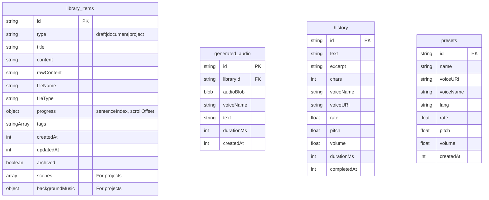

# MK VoiceKit — Upgrade Plan

This document details the blueprint for transforming MK VoiceKit from a basic text-to-speech utility into a polished, privacy-first voice and reading workspace.

---

## 1. Current Architecture & Feature Inventory

MK VoiceKit is a local-first Next.js (App Router) web application. 

```
Browser
├─ React UI (App Router client components)
├─ Speech engine state machine (SpeechSynthesis / OS voices)
├─ Parsers (txt / md / pdf / srt / vtt)
├─ Deterministic text-prep (abbreviations, numbers, pauses)
└─ IndexedDB (history, presets, queue, prefs, stats) via idb

Server (Vercel, optional)
└─ POST /api/ai/[capability] (Zod → rate-limiting → Vercel AI Gateway)
```

### Current Feature Inventory
1. **Text to Speech**: Simple text input with browser speechSynthesis playback.
2. **File Imports**: Client-side drag-and-drop parsing for `.txt`, `.md`, `.pdf`, `.srt`, and `.vtt`.
3. **Queue**: Sequential listening playlist in IndexedDB.
4. **Presets**: Stored voice parameters (rate, pitch, volume, voice URI).
5. **Deterministic Text Prep**: Capitalization, punctuation, and number normalization.
6. **Optional AI**: Text improvement commands proxying to Vercel AI Gateway.

---

## 2. Confirmed Problems & Friction Points

Based on codebase analysis and requirements:
1. **Lack of Workspace Differentiation**: The current workspace is one monolithic page combining editor, queue, presets, and AI.
2. **Missing Document Reading Navigation**: No table of contents, progress resume, scroll tracking, or reading ruler.
3. **No Voice Studio**: No multi-block scripts, custom pauses, scene sequencing, or background audio mixing.
4. **No Transcription Support**: No microphone recording, audio file upload, or speech-to-text diarization.
5. **Rudimentary Library**: Saved items are limited to basic history logs and raw queue arrays. No tagging, search, document archival, or binary audio storage.
6. **No Multi-Provider API Support**: The backend is hardcoded to use Vercel AI SDK Gateway with a single fallback model.
7. **Basic CSS Spacing & Accessibility**: Lack of responsive mobile player, Dyslexia-friendly fonts, and focus indicators.

---

## 3. Product Structure: Five Primary Workspaces

We will create a multi-tab or side-nav layout dividing the workspace into:
1. **Text to Speech**: Highly optimized, distraction-free textarea with character/word/duration counters, full-screen mode, dyslexia-friendly settings, find-and-replace, and language auto-suggestion.
2. **Document Reader**: Side-by-side reading layout with TOC extraction, reading progress preservation, clean-reader overlays, customizable layouts (margins, line height, font scaling), and document search.
3. **Voice Studio**: Light timeline editor where users compile "Scenes" with distinct voices, pitches, speeds, and pauses, alongside background music overlays.
4. **Transcription**: Speech-to-text workspace supporting microphone recording and audio/video file uploads with timestamps, speaker labels, and clean transcript exports.
5. **Library**: Centralized IndexedDB hub for documents, drafts, projects, generated audio, search tags, and archive filters.

---

## 4. Planned Changes & New Features

### Layout & Theme
- **Main Nav**: Minimalist header layout toggling between the 5 primary workspaces, plus a settings modal.
- **Mobile Playback**: Sticky bottom control bar and persistent mini-player.
- **Reading Aids**: Atkinson Hyperlegible and open-dyslexic font scaling, high-contrast highlighting, and reading ruler.

### Backend & AI Providers
- **Provider Adapters**: Extensible backend interface supporting OpenAI, ElevenLabs, Google Cloud TTS, Azure, and Amazon Polly.
- **Secure Server-side Extraction**: Server API route (`/api/extract`) that securely fetches webpage text without exposing client IPs or CORS issues.
- **SSML Validation**: Server-side SSML schema validator for AI providers.

---

## 5. Database Schema & Migration (v1 → v2)

The database schema will be upgraded to support complex library storage, tags, and binary audio files.



### Safe DB Upgrades (IndexedDB Migration)
We will increase the database version from `1` to `2`.
The `upgrade` event in `storage.ts` will:
1. Create a `library` object store with index on `type` and `archived`.
2. Create a `generated_audio` object store with index on `libraryId`.
3. Preserve existing `history`, `presets`, and `kv` (kv holds preferences, stats, queue).

---

## 6. Implementation Phases

We will complete work sequentially:

### Phase A: Core Enhancements, Mobile UX & Accessibility
- DISTRACTION-FREE text editor with character, word, and estimated audio counters.
- Replay and skip controls (sentence/paragraph skip).
- Voice search, favorites, recently used voice tracking, and automatic best-voice suggestion (by script detection).
- Reading ruler, dyslexia-friendly display mode, and fullscreen focus mode.
- Sticky bottom mobile playback bar and mini-player.
- Accessibility audit (WCAG 2.2 AA).

### Phase B: Document Reader, Local Library & Daily-Use Tools
- Document Reader workspace supporting PDF, TXT, Markdown, DOCX, and EPUB.
- Table of Contents extraction, progress tracking, and reading settings (font, line-height, width).
- Library workspace with tags, search, archive/delete, bulk actions, and storage indicators.
- Webpage extractor API route (`/api/extract`).
- Focused daily-use utility routes (pronunciation editor, reading-time calculator, script timer, text cleaner, subtitle viewer).

### Phase C: Voice Studio Workspace
- Visual light-DAW timeline composition interface.
- Projects management: multi-scene scripts, voice mapping per scene.
- Drag-and-drop scene reordering.
- Background music upload and fade settings.
- MP3/WAV export option (active when AI audio provider is selected).

### Phase D: AI Provider Integrations
- Extensible API route matching a provider-neutral server interface.
- Implement ElevenLabs and OpenAI TTS server adapters first.
- Quota, cost estimation, BYOK injection, rate-limiting, and error fallback.
- "Improve with AI" features with side-by-side diff previews.

### Phase E: Transcription & Dubbing
- Mic recorder + audio file uploader.
- Speech-to-text adapter (Whisper/Google Cloud).
- Transcripts editor with timestamps, diarization, and clean-ups.
- Assisted Dubbing workflow (translate transcript -> generate target voice -> align).

### Phase F: SEO, Docs & QA
- Registry-driven fast landing pages.
- Structured sitemap, robots, JSON-LD metadata.
- Comprehensive end-to-end testing with Playwright.

---

## 7. Acceptance Criteria

1. **Deterministic Core Works Offline**: The app loads and plays local text/documents without needing an internet connection.
2. **Privacy First**: No document text or voice scripts are stored on any server.
3. **Responsive & Mobile Friendly**: Playback bar remains clickable and visible on mobile, with no side layout overflow at 320px width.
4. **Accessible (WCAG 2.2 AA)**: Fully keyboard-navigable, keyboard shortcuts listed are fully functional, Atkinson Hyperlegible and open-dyslexic font scaling renders correctly.
5. **No Placeholders**: Every button is fully wired to actual browser speech or provider mocks.
6. **Tests & Build Green**: `tsc`, `eslint`, `vitest`, and `playwright` all pass locally and in CI.
